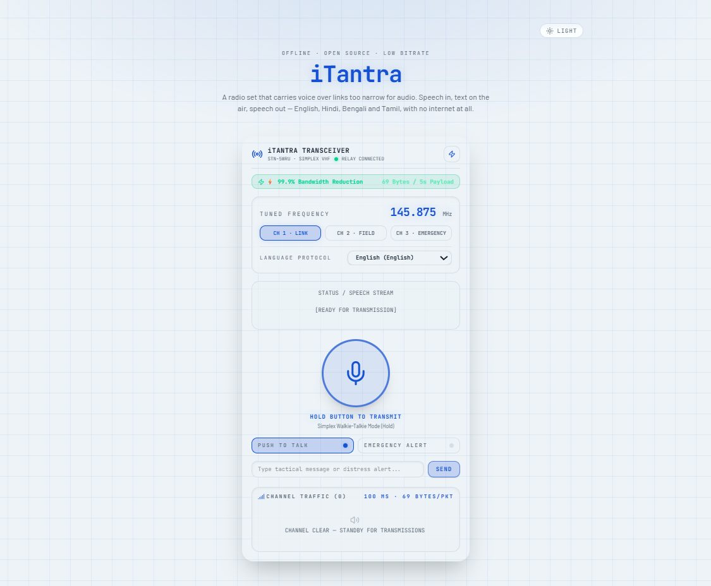
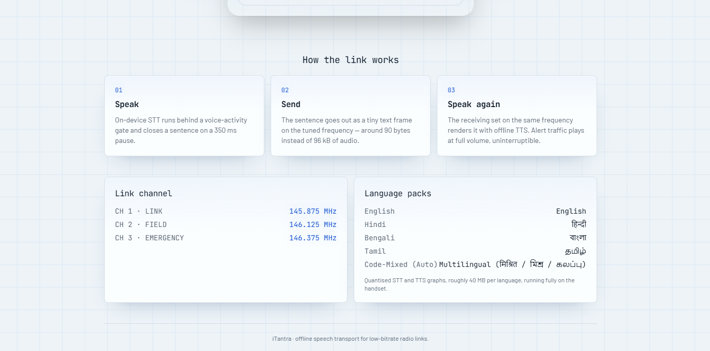

# iTantra — Indian Multilingual TTS & STT Neural Transceiver

Smart India Hackathon 2026 — Problem Statement SIH26173
Team: KABOOTAR
Theme: Miscellaneous | Category: Software

iTantra is an offline-capable, multilingual neural voice transceiver designed for communication over low-bandwidth and unreliable links. Instead of transmitting raw voice/audio, the system converts speech into lightweight text, transfers the text over a constrained communication channel, and reconstructs it as speech at the receiving side.

This approach is intended for rural and low-connectivity environments, disaster/emergency communication, field operations, remote communities, and situations where conventional internet-based voice communication is unreliable.

## 📌 Problem Statement

Voice/audio communication is data-intensive. Over low-data-rate links, transmitting raw audio can require significantly more bandwidth and can become unreliable, especially during:

Disaster and emergency situations

Network outages

Remote/rural operations

Low-bandwidth environments

Field communication

Situations where mobile data or cloud services are unavailable

iTantra addresses this by transforming:

Speech → Speech-to-Text (STT) → Lightweight Text → Transmission → Text → Text-to-Speech (TTS) → Speech

The result is a communication pipeline that minimizes the amount of information that needs to cross the constrained link.





## 🚀 Key Features

1. Speech-to-Text (STT)

Captures a user's voice and converts speech into a text representation before transmission.

2. Text-to-Speech (TTS)

Converts received text back into speech so that the receiver can hear the message naturally.

3. Multilingual Communication

Designed to support communication across Indian/regional languages through multilingual STT and TTS components. (Supportive Languages: English, Hindi, Bengali, Tamil)

4. Low-Bandwidth Communication

Transmits lightweight text rather than raw audio, reducing communication data requirements.

5. Offline / On-Device AI Capability

The architecture is designed to support local STT/TTS inference, reducing dependency on cloud APIs and internet connectivity when suitable on-device models are available.

6. Device-to-Device Communication

The proposed communication layer can operate through available local connectivity mechanisms such as:

Wi-Fi

Bluetooth

Radio links

Local/LAN communication

7. Walkie-Talkie Style Interaction

The prototype concept includes a push-to-talk interaction model for short, real-time voice messages.

8. Emergency Communication

Includes an emergency-oriented communication concept with alert priority functionality for situations where rapid message exchange is important.

9. Network Simulation & Live Metrics

The technical approach includes a WebSocket-based simulation layer for evaluating constrained communication conditions and monitoring metrics such as:

Bandwidth

Packet loss

Latency

Bitrate

Word Error Rate (WER)

10. Browser-Based Audio Capture

The proposed frontend uses browser audio capabilities such as the Web Audio API / MediaRecorder API for capturing and playing audio.

## 🧠 System Workflow

The iTantra communication pipeline follows a Speech → Text → Transmission → Speech architecture:

```text
┌──────────────┐
│   Person A   │
└──────┬───────┘
       │ Speech
       ▼
┌──────────────────────┐
│   Audio Capture      │
│ + Noise Suppression  │
└──────────┬───────────┘
           │
           ▼
┌──────────────────────┐
│   Multilingual STT   │
│    Speech → Text     │
└──────────┬───────────┘
           │ Lightweight Text
           ▼
┌──────────────────────┐
│ Compression /        │
│ Encoding / FEC       │
└──────────┬───────────┘
           │
           │ Wi-Fi / Bluetooth /
           │ Radio / WebSocket
           ▼
┌──────────────────────┐
│ Reception +          │
│ Decompression        │
└──────────┬───────────┘
           │ Text
           ▼
┌──────────────────────┐
│   Multilingual TTS   │
│    Text → Speech     │
└──────────┬───────────┘
           │
           ▼
┌──────────────┐
│   Person B   │
└──────────────┘
```

## 🏗️ Technical Architecture

The proposed architecture is divided into six major stages:

Stage 1 — Voice Input & Noise Suppression

The browser/client captures the user's voice. Audio preprocessing and voice activity detection can be applied to improve recognition quality.

Stage 2 — Neural Multilingual STT

The speech signal is passed to a multilingual speech-recognition component, which converts the audio into a text representation.

Stage 3 — Compression & Transmission

The recognized text is processed using encoding/compression techniques and can include error-control mechanisms before transmission.

Because text is substantially lighter than raw voice/audio, the communication channel can operate with lower bandwidth requirements.

Stage 4 — Reception & Decompression

The receiver obtains the transmitted data, performs decoding/error recovery, and reconstructs the text message.

Stage 5 — Audio Reconstruction & Playback

The reconstructed text is passed to the TTS engine, which generates speech for the receiving user.

Stage 6 — Network Simulation & Live Metrics

A WebSocket/communication layer can simulate constrained network conditions and expose live communication metrics for evaluation.

## 🛠️ Technology Stack

Layer

Technologies / Components

Frontend

HTML, CSS, JavaScript

Backend

Node.js, FastAPI

Transport

WebSocket

Audio

Web Audio API, MediaRecorder API

Edge Inference

ONNX Runtime Web / WebAssembly

ML / Mobile Inference

TensorFlow Lite, PyTorch Mobile

Data / Logging

SQLite, JSON logs

Deployment

Localhost / LAN

Speech Recognition References

AI4Bharat/Vakyansh ASR, whisper.cpp

Speech Synthesis References

AI4Bharat Indic-TTS, sherpa-onnx

Data References

AI4Bharat IndicCorp / IndicVoices, IITM Indic-TTS Dataset

Important: The project proposal lists several model/runtime options and research references. The exact model used in a particular build should be documented in the corresponding source/configuration files rather than assumed from the proposal.

## 🤖 AI / ML Components

Speech-to-Text

The research and technical proposal references:

AI4Bharat / Vakyansh ASR Toolkit — Indic-language ASR models

whisper.cpp — optimized/offline inference of OpenAI Whisper models

Text-to-Speech

The proposal references:

AI4Bharat Indic-TTS — Indic-language TTS models

sherpa-onnx — on-device TTS inference using ONNX-based models

Edge / Offline Inference

Potential runtimes mentioned in the architecture include:

ONNX Runtime Web / WebAssembly

TensorFlow Lite

PyTorch Mobile

The overall objective is to move inference closer to the user/device wherever hardware and model size permit.

## 📡 Low-Bandwidth Communication Strategy

Traditional voice communication sends a continuous audio stream. iTantra instead follows a semantic communication approach:

Raw Speech
    ↓
Speech Recognition
    ↓
Text Representation
    ↓
Compression / Encoding
    ↓
Low-Bandwidth Link
    ↓
Decoding
    ↓
Text
    ↓
Speech Synthesis
    ↓
Reconstructed Voice

This is particularly useful when the communication channel has:

Low bitrate
<<<<<<< HEAD

High latency

Packet loss

Intermittent connectivity

Limited data availability
=======
>>>>>>> a7b85f0fffb03611206e50b62e3e24a345198aa2

High latency

Packet loss

Intermittent connectivity

Limited data availability

## 📊 Network & Evaluation Metrics

The proposed prototype includes live monitoring/simulation of communication conditions. Relevant metrics include:

Bandwidth

Measures the communication capacity available to the system.

Bitrate

Measures the amount of transmitted information per unit time.

Latency

Measures the delay between transmission and reception.

Packet Loss

Measures the proportion of transmitted packets that fail to reach the receiver.

Word Error Rate (WER)

Measures speech-recognition accuracy by comparing recognized text with reference/transcribed text.

A standard WER formulation is:

WER = (Substitutions + Deletions + Insertions) / Number of Reference Words

For multilingual evaluation, these metrics should ideally be reported separately for each supported language rather than only as one overall score.

## 🌐 Communication Modes

The architecture is intended to support communication over locally available links such as:

Wi-Fi

Bluetooth

Radio

LAN

WebSocket-based prototype/simulation

The actual physical radio integration can be treated as a deployment-specific communication layer while the STT → text → TTS pipeline remains modular.

## 🖥️ Prototype Concept

The proposal's current prototype UI demonstrates a radio/communication interface containing concepts such as:

Frequency/channel information

Connection/standby state

Language selection

Push-to-talk control

Voice input

Alert priority

Traffic/status information

Message/communication area

This UI is designed around a walkie-talkie-style communication experience.

## 👥 Target Users

iTantra is designed with the following user groups in mind:

Rural and low-connectivity users
<<<<<<< HEAD

Regional-language users

Low-end device users

Emergency and disaster-response teams

Field teams

Students and event teams

Remote communities

Users who cannot depend on continuous internet access
=======
>>>>>>> a7b85f0fffb03611206e50b62e3e24a345198aa2

Regional-language users

Low-end device users

Emergency and disaster-response teams

Field teams

Students and event teams

Remote communities

Users who cannot depend on continuous internet access

## 🌍 Expected Impact

Social Impact

Improves communication accessibility in remote communities

Supports regional-language communication

Helps communication during emergencies

Environmental Impact

Reduces dependence on dedicated communication hardware

Makes better use of existing smartphones

Encourages lightweight processing

Economic Impact

Reduces dependency on expensive telecom infrastructure

Works toward low/mid-range device compatibility

Reduces mobile-data requirements

Disaster & Public Safety
<<<<<<< HEAD

Provides an alternative communication channel during network outages

Can help responders exchange critical information

Supports short-range communication without continuous internet dependency
=======
>>>>>>> a7b85f0fffb03611206e50b62e3e24a345198aa2

Provides an alternative communication channel during network outages

<<<<<<< HEAD
Challenge

Proposed Mitigation

Limited CPU / RAM / battery

Quantization and compressed models

STT accuracy affected by accents/noise

Noise filtering and language-specific models

Regional language variation

Multilingual/language-specific speech models

Connectivity interruptions

Reconnection and adaptive switching

Limited Wi-Fi/Bluetooth/radio range

Modular communication layer

Large AI models

Edge optimization and lightweight runtimes

Adding new languages/devices

Modular architecture
=======
Can help responders exchange critical information

Supports short-range communication without continuous internet dependency
>>>>>>> a7b85f0fffb03611206e50b62e3e24a345198aa2

## ⚠️ Challenges & Mitigation Strategies

Challenge

Proposed Mitigation

Limited CPU / RAM / battery

Quantization and compressed models

STT accuracy affected by accents/noise

Noise filtering and language-specific models

Regional language variation

Multilingual/language-specific speech models

Connectivity interruptions

Reconnection and adaptive switching

Limited Wi-Fi/Bluetooth/radio range

Modular communication layer

Large AI models

Edge optimization and lightweight runtimes

Adding new languages/devices

Modular architecture

## 🔐 Security & Privacy Considerations

An offline-capable design can reduce the need to send raw voice recordings to cloud services.

Recommended implementation practices:

Keep API keys and credentials outside Git

Use .env files for secrets

Never commit passwords or tokens

Avoid committing private datasets

Validate received communication payloads

Restrict local network access where appropriate

Log only information required for debugging/evaluation

Never upload API keys, passwords, tokens, private certificates, or other secrets to GitHub.

## 📁 Suggested Repository Structure

The exact structure should match the implementation in the repository. A clean structure can look like:

iTantra/
│
├── frontend/
│   ├── index.html
│   ├── css/
│   └── js/
│
├── backend/
│   ├── api/
│   ├── services/
│   └── models/
│
├── ml/
│   ├── stt/
│   ├── tts/
│   └── preprocessing/
│
├── network/
│   ├── websocket/
│   └── simulation/
│
├── data/
│   └── sample/
│
├── logs/
│
├── README.md
├── .gitignore
└── LICENSE

Treat this as a recommended organization, not a claim about the current local folder structure.

## 🚀 Getting Started

1. Clone the repository

git clone https://github.com/<YOUR-USERNAME>/<YOUR-REPOSITORY>.git
cd <YOUR-REPOSITORY>

2. Install the required dependencies

Install the dependencies required by the frontend, backend and ML components used by your particular implementation.

For example, a project using Node.js and Python may require:

npm install

and a Python environment such as:

python -m venv .venv

Then activate the environment and install the project's Python dependencies if a requirements.txt file is present:

pip install -r requirements.txt

Replace these commands with the exact commands used by your implementation before publishing the final README.

3. Configure environment variables

If the project uses environment variables, create a local .env file.

Do not commit .env or credentials to GitHub.

4. Start the application

Use the project's actual frontend/backend startup commands. Document the exact commands here once the repository entry points are finalized.

## 🧪 Testing & Evaluation

The project can be evaluated at multiple levels:

Speech Recognition

WER

Language-wise accuracy

Noise robustness

Accent/variation robustness

Communication

End-to-end latency

Effective bitrate

Packet-loss tolerance

Reconnection behavior

Speech Reconstruction

TTS quality

Intelligibility

Language correctness

System
<<<<<<< HEAD

CPU usage

Memory consumption

Model size

Battery/resource requirements

Performance on low-end hardware
=======
>>>>>>> a7b85f0fffb03611206e50b62e3e24a345198aa2

CPU usage

Memory consumption

Model size

Battery/resource requirements

Performance on low-end hardware

## 🔬 Research References

The proposal references the following technologies and datasets for the STT/TTS pipeline:

AI4Bharat / Vakyansh ASR Toolkit

whisper.cpp

AI4Bharat Indic-TTS

sherpa-onnx

AI4Bharat IndicCorp / IndicVoices

IITM Indic-TTS Dataset

These references are intended to support the development of multilingual speech recognition and synthesis components.

## 🗺️ Future Scope

Potential extensions include:
<<<<<<< HEAD

Adding more Indian languages

Improved language-specific speech recognition

Better noise suppression

Model quantization and pruning

More efficient edge inference

Automatic communication-link selection

Adaptive bitrate/encoding

Real radio-hardware integration

Stronger packet-loss recovery

Expanded emergency-alert functionality

More comprehensive language-wise benchmarking
=======
>>>>>>> a7b85f0fffb03611206e50b62e3e24a345198aa2

Adding more Indian languages

Improved language-specific speech recognition

Better noise suppression

Model quantization and pruning

More efficient edge inference

Automatic communication-link selection

Adaptive bitrate/encoding

Real radio-hardware integration

Stronger packet-loss recovery

Expanded emergency-alert functionality

More comprehensive language-wise benchmarking

## 🏆 Project Context

Project: iTantra
Problem Statement: SIH26173
Event: Smart India Hackathon 2026
Team: KABOOTAR

The project aims to combine multilingual speech AI, lightweight text transmission and resilient local communication into a practical communication system for low-bandwidth environments.

## 👨‍💻 Team

KABOOTAR — Smart India Hackathon 2026
1. Sovit Swain
2. Sumana Shyam
3. Jayita Mandal
4. Anubhab Samantaray
5. Akansha Ajay
6. Ishita Singh

## ⭐ If You Find This Project Useful

Consider starring the repository and sharing feedback or suggestions through GitHub Issues.
